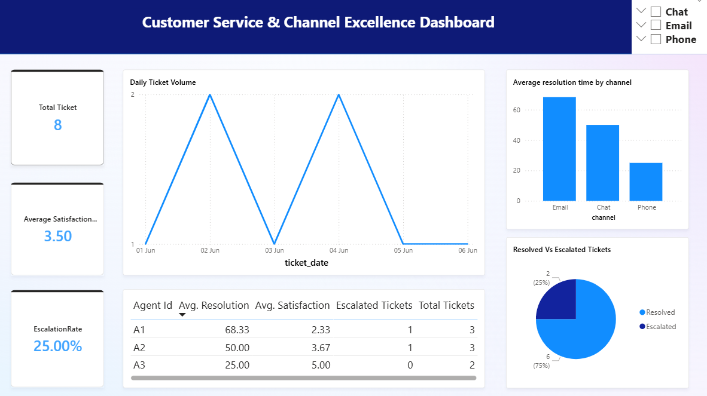

# 📊 CSCE Customer Service & Channel Excellence Dashboard

A complete data analytics and visualization project built using **Power BI**, **Python (pandas)**, and **SQL**, focused on analyzing Customer Service & Channel Excellence (CSCE) metrics like ticket trends, escalation rates, and agent performance.

---

## 🔍 Project Overview

This dashboard helps visualize and explore:

- Escalation trends across different channels  
- Daily ticket volume trends  
- Average resolution time by channel  
- Agent performance KPIs  
- Status breakdown (resolved vs escalated)

It simulates a real-world CSCE dataset and supports decision-making for operations or customer success teams.

---

## ⚙️ Tools & Tech Used

- **Power BI** (DAX measures, KPI visuals, slicers)  
- **Python (pandas, sqlite3)** for preprocessing, grouping, and exporting agent summaries  
- **SQL** (via SQLite) for analytical queries  

---

## 📊 Dashboard Features

- 📈 **Line Chart** – Daily Ticket Volume  
- 🔢 **KPI Cards** – Total Tickets, Avg Satisfaction, Escalation Rate  
- 📊 **Bar Chart** – Avg Resolution Time by Channel  
- 🧩 **Pie Chart** – Ticket Status Breakdown  
- 📋 **Table** – Agent-wise Ticket Count, Avg Resolution, Escalation Count  
- 📅 **Slicers** – Date Range, Agent, Channel  

---

## 🧠 Key Insights Enabled

- Which agents handle the most tickets and with highest satisfaction?  
- What percentage of tickets get escalated?  
- Which channels have the highest resolution times?  
- Ticket trends across time  

---

## 🚀 How to Run

1. Open `csce_dashboard.pbix` in Power BI Desktop  
2. Use slicers to filter by channel, date range, or agent  
3. Hover over charts or drill into agent performance  

> *(Optional: Reconnect data sources if files are moved)*

---

## 📷 Preview Screenshots

  

---

## 📬 Connect

**Author**: *Isfar Ibn Mufty*  
📫 isfarakshar@gmail.com
    

Feel free to fork or build upon this for customer support analytics, helpdesk performance, or business operations dashboards.

